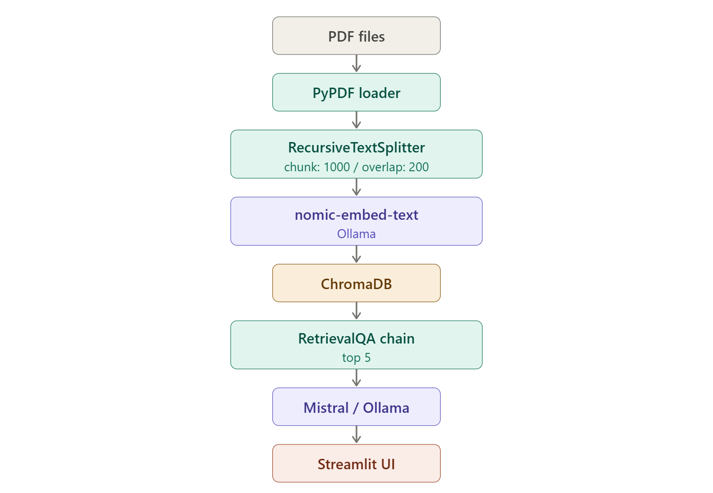

# automotive-rag-assistant


Local RAG pipeline for querying automotive engineering documents (AUTOSAR, OBD-II, ISO 26262).
Uses Ollama for inference and embeddings, ChromaDB for vector storage, and Streamlit for the UI.

## Architecture



Key decisions:

- **Chunk size 1000, overlap 200** -- balances context window usage with retrieval granularity
- **nomic-embed-text** -- open embedding model optimized for retrieval, runs locally via Ollama
- **mistral** -- good balance of speed and quality for technical Q&A at 7B parameters
- **ChromaDB** -- lightweight vector store, no external services needed
- Answers include source tracking: PDF filename, page number, and a 200-char excerpt

## Prerequisites

- Python 3.11+
- [Ollama](https://ollama.com) installed and running
- ~6 GB disk space for models

## Setup

### 1. Clone and install dependencies

```bash
git clone https://github.com/<your-username>/automotive-rag-assistant.git
cd automotive-rag-assistant

python -m venv venv

# Linux / macOS
source venv/bin/activate

# Windows (PowerShell)
venv\Scripts\activate

pip install -r requirements.txt
```

### 2. Pull Ollama models

```bash
ollama pull mistral
ollama pull nomic-embed-text
```

Make sure Ollama is running (`ollama serve` if it is not started automatically).

### 3. Download documents

```bash
python setup/download_docs.py
```

This downloads 11 public automotive PDFs (~20 MB total) organized by category into
`data/`. You can also drop your own PDFs into `data/` or any subdirectory -- they will
be picked up during indexing.

### 4. Configure environment (optional)

```bash
cp .env.example .env
```

Edit `.env` if you need to change the Ollama URL or models. Defaults work out of the box.

### 5. Run the app

```bash
streamlit run app.py
```

On first run, click **index documents** in the sidebar to build the vector store.
Subsequent runs will load the existing index from `embeddings/`.

## Project structure

```
automotive-rag-assistant/
  app.py                Streamlit interface
  rag/
    config.py           Configuration and constants
    ingest.py           PDF loading, chunking, embedding pipeline
    retriever.py        RAG chain and source formatting
  setup/
    download_docs.py    Downloads public automotive PDFs
    init_git_history.sh Initializes git repo with backdated commits
  data/                 PDF documents (gitignored)
  embeddings/           ChromaDB vector store (gitignored)
```

## How it works

1. `ingest.py` loads all PDFs from `data/`, splits them into 1000-char chunks with 200-char
   overlap using LangChain's `RecursiveCharacterTextSplitter`
2. Chunks are embedded using `nomic-embed-text` via Ollama and stored in ChromaDB
3. When you ask a question, the retriever finds the top 5 most similar chunks
4. Those chunks are passed as context to `mistral` with a prompt that constrains answers
   to the indexed documents only
5. The answer is displayed with collapsible source citations showing the PDF name, page
   number, and a 200-char excerpt from the matched chunk

## Document catalog

All documents are publicly available, no authentication required.

### autosar

| Document | Source | URL |
|----------|--------|-----|
| AUTOSAR CP Layered Software Architecture (R25-11) | autosar.org | [link](https://www.autosar.org/fileadmin/standards/R25-11/CP/AUTOSAR_CP_EXP_LayeredSoftwareArchitecture.pdf) |
| AUTOSAR Methodology (R22-11) | autosar.org | [link](https://www.autosar.org/fileadmin/standards/R22-11/CP/AUTOSAR_TR_Methodology.pdf) |
| AUTOSAR Introduction Part 1 | autosar.org | [link](https://www.autosar.org/fileadmin/user_upload/AUTOSAR_Introduction_PDF/AUTOSAR_EXP_Introduction_Part1.pdf) |

### functional_safety

| Document | Source | URL |
|----------|--------|-----|
| ISO 26262 / IEC 61508 functional safety overview | NXP Semiconductors | [link](https://community.nxp.com/pwmxy87654/attachments/pwmxy87654/tech-days/160/1/AMF-AUT-T2713.pdf) |
| Automotive functional safety and ISO 26262 | exida | [link](https://www.exida.com/marketing/automotive-iso26262.pdf) |
| ISO 26262 white paper for modern road vehicles | ROHM Semiconductor | [link](https://fscdn.rohm.com/en/products/databook/white_paper/iso26262_wp-e.pdf) |

### cybersecurity

| Document | Source | URL |
|----------|--------|-----|
| Vehicle cybersecurity threats and CAN bus analysis | NREL (US Dept of Energy) | [link](https://docs.nrel.gov/docs/fy19osti/74247.pdf) |
| Cyber security and resilience of smart cars | ENISA / UNECE | [link](https://wiki.unece.org/download/attachments/42041673/TFCS-03-09e%20ENISA%20Cyber%20Security%20and%20Resilience%20of%20smart%20cars.pdf?api=v2) |
| Automotive cybersecurity regulations | OICA / UNECE | [link](https://wiki.unece.org/download/attachments/154665132/W2P1%20OICA.pdf?version=1&modificationDate=1643908534916&api=v2) |

### diagnostics

| Document | Source | URL |
|----------|--------|-----|
| OBD-II regulation with UDS protocol requirements | California ARB | [link](https://ww2.arb.ca.gov/sites/default/files/barcu/regact/2021/obd2021/isor.pdf) |
| Getting started with OBD-II | DigiKey | [link](https://mm.digikey.com/Volume0/opasdata/d220001/medias/docus/1268/Getting_Started_with_OBD-II.pdf) |

## Adding your own documents

Drop any PDF into `data/` (or a subdirectory for category grouping) and click
**index documents** in the sidebar. The entire corpus will be re-indexed. For large
document sets, indexing can take a few minutes depending on your hardware.

## Troubleshooting

| Problem | Fix |
|---------|-----|
| "ollama is not running" banner | Run `ollama serve` in a terminal |
| Slow embeddings | First run downloads the model; subsequent runs are faster |
| Empty answers | Make sure you clicked "index documents" after adding PDFs |
| Import errors | Verify you activated the venv and ran `pip install -r requirements.txt` |

## License

MIT
